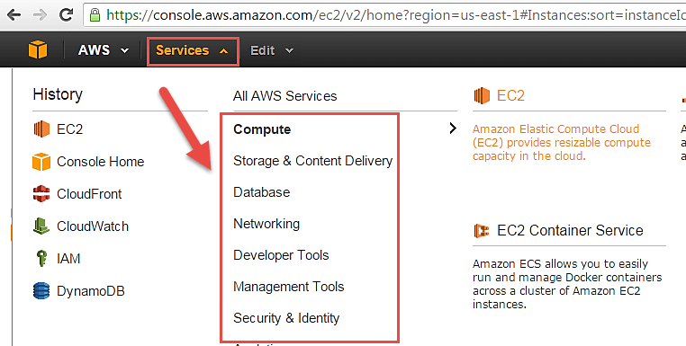
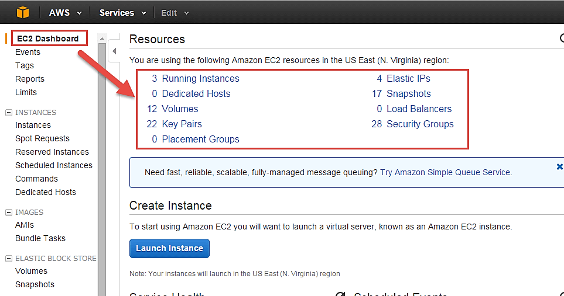
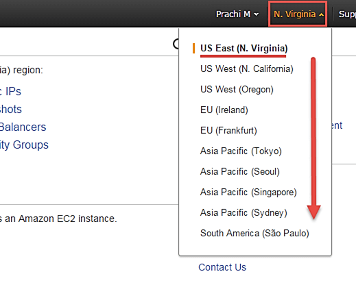
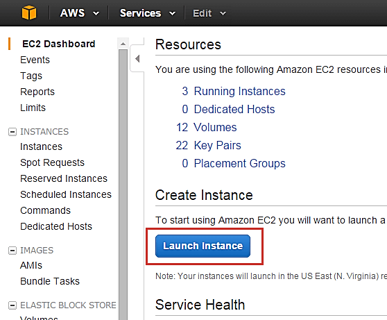

# What is Amazon EC2 Instance?

An **EC2 instance** is nothing but a virtual server in Amazon Web services terminology.
It stands for **Elastic Compute Cloud**.

## Login and access to AWS services

**Step 1)** In this step,

- Login to your AWS account and go to the AWS Services tab at the top left corner.
- Here, you will see all of the AWS Services categorized as per their area viz. Compute, Storage, Database, etc. For creating an EC2 instance, we have to choose Computeà EC2 as in the next step.

* Open all the services and click on EC2 under Compute services. This will launch the dashboard of EC2.

Here is the EC2 dashboard. Here you will get all the information in gist about the AWS EC2 resources running.

**Step 2)** On the top right corner of the EC2 dashboard, choose the AWS Region in which you want to provision the EC2 server.

Here we are selecting N. Virginia. AWS provides 10 Regions all over the globe.

**Step 3)** In this step

- Once your desired Region is selected, come back to the EC2 Dashboard.
- Click on ‘Launch Instan\*ce’ button in the section of Create Instance (as shown below).

- Instance creation wizard page will open as soon as you click ‘Launch Instance’.

see more - https://www.guru99.com/creating-amazon-ec2-instance.html
